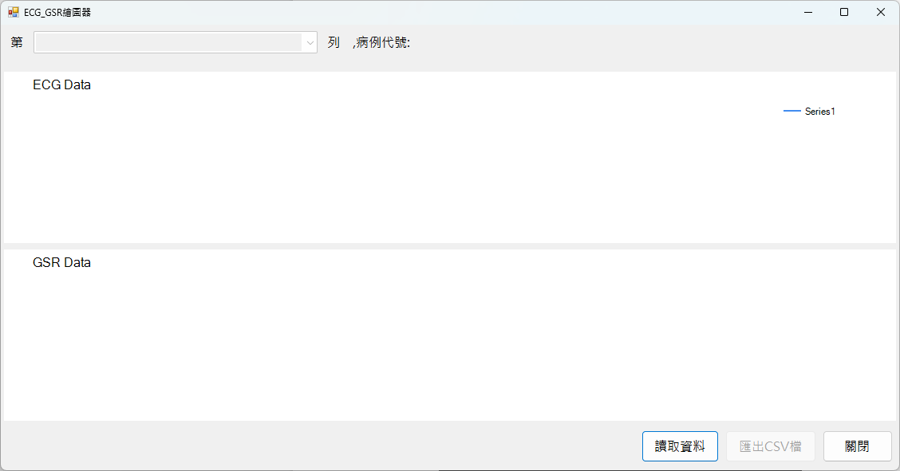
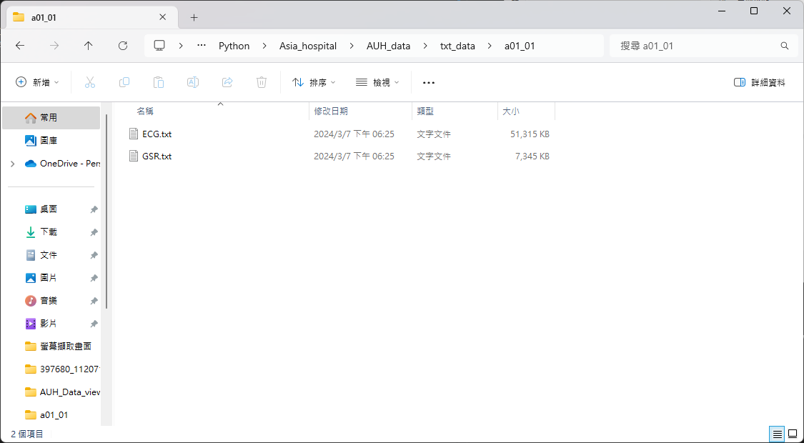
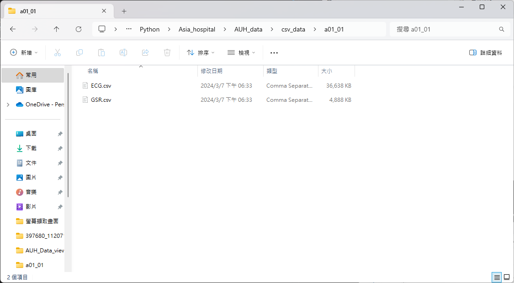
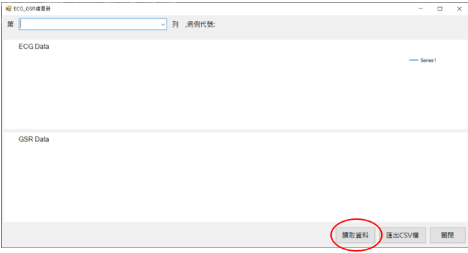
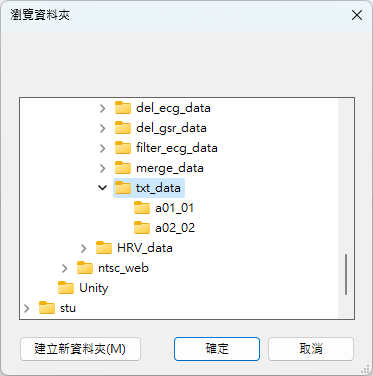
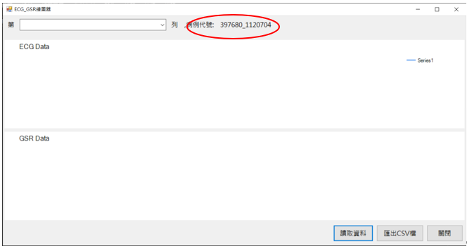
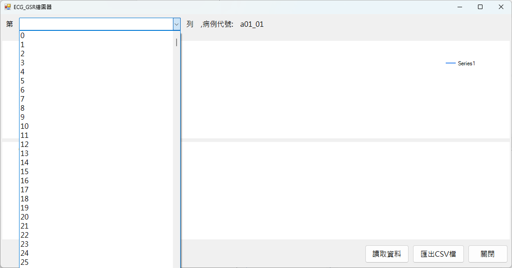
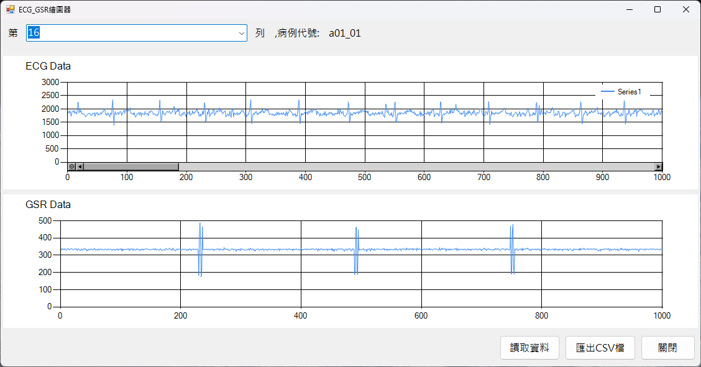
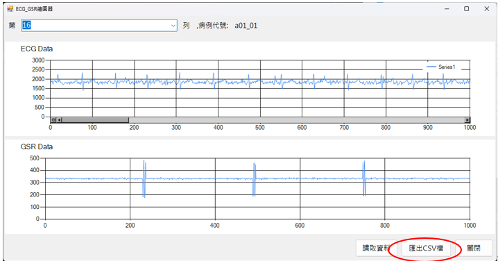
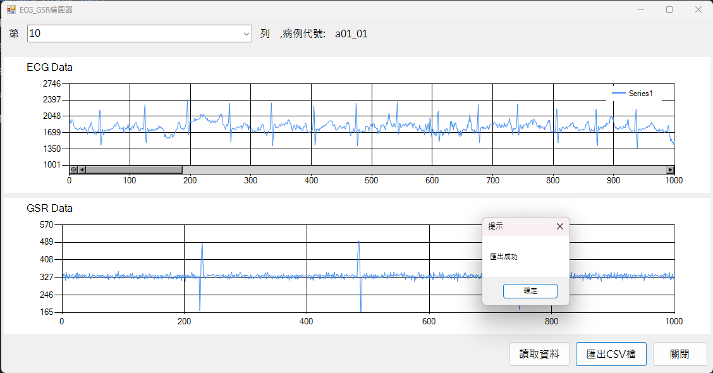

# AUH_Data_viewing_tools

## 1. 程式開啟畫面

## 2. 讀入數據

### A. 數據規則
請先將同一病人的數據放置於同一資料夾內，並以"病歷號_量測日期"命名，資料夾內心電圖數據請以"ECG"命名，膚電數據請以"GSR"命名，檔案格式請以 txt 或 CSV 儲存。

### B. 點選讀取資料按鈕(紅圈處)

### C. 選擇資料夾

## 3. 選擇要檢視的資料列

### A. 讀入數據後會呈現病例代號及測試時間(紅圈處)

### B. 即可點選下拉式選單選擇要檢視的列資料

### 最後即會呈現ECG和GSR數據繪圖結果

## 4.  匯出CSV

在匯入數據後，如要匯出整個量測資料即可點選匯出CSV檔按鈕(紅圈處)，即可匯出ECG和GSR資料

檔案位置會在當前程式執行的目錄下，並以"病歷號_量測日期"命名

